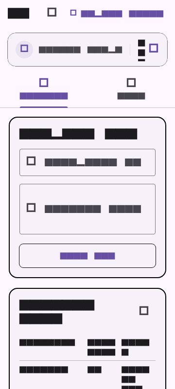
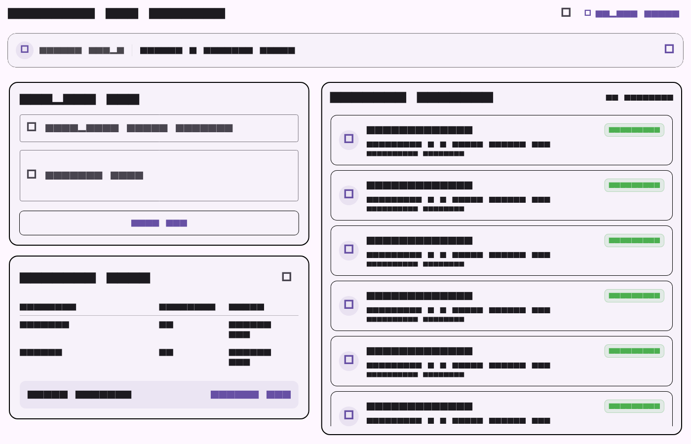
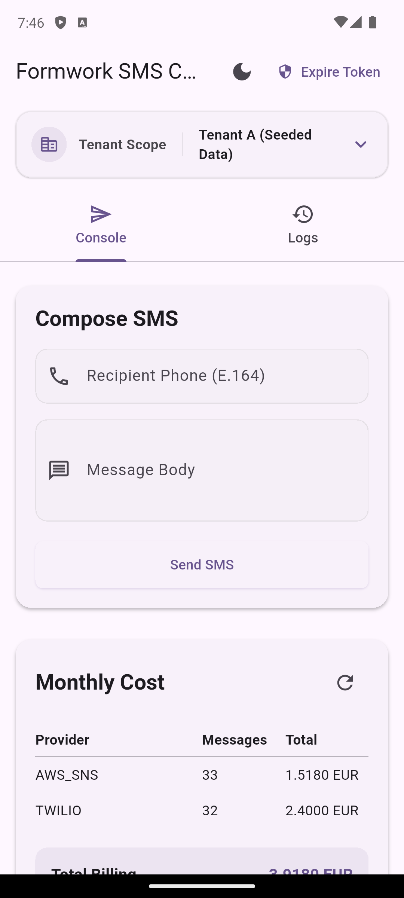
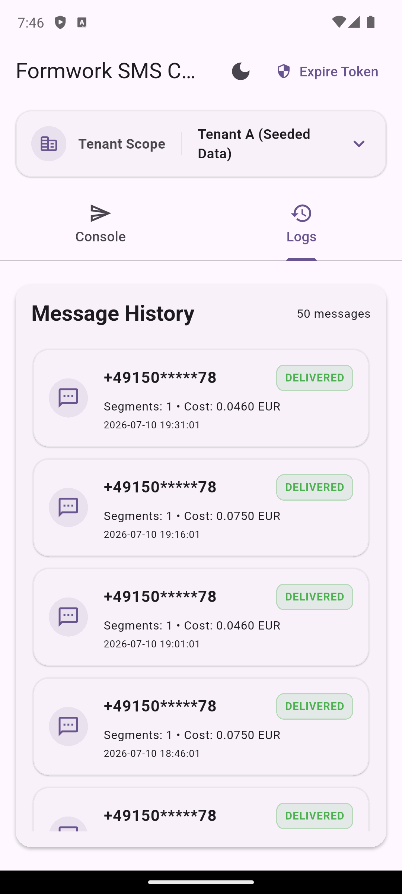

# Studio Butterfly — Flutter Engineer Take-Home

This repository contains the take-home submission for the Studio Butterfly Flutter Take-Home Assignment.

It includes:
1. **[REVIEW.md](REVIEW.md)** — A detailed security, logical, and performance audit containing 12 major defects discovered in the AI-generated starter project.
2. **[flutter-assignment/](flutter-assignment/)** — A complete rewrite of the application using Clean Feature-First Architecture, BLoC state management, custom Money minor units math (exact decimal operations with zero third-party dependencies), and a fully testable adaptive UI.
3. **[AI-USAGE.md](AI-USAGE.md)** — Transparency log detailing AI usage, errors, and manual overrides.
4. **[docs/adr/0001-state-management.md](docs/adr/0001-state-management.md)** — Architectural Decision Record (ADR) justifying framework and layout breakpoints.

---

## Responsive Layouts (Golden Test Output)

We verified our adaptive layouts using widget and golden tests. Below are the direct screenshot renders generated by our golden test suite:

### Mobile Viewport (360 px width)


### Desktop Viewport (1400 px width)


---

## App Screenshots

Below are screenshots of the running application:

| Console Tab (Composer & Billing) | Logs Tab (Message History) |
|:---:|:---:|
|  |  |

---

## Repository Structure & Architectural Map

The codebase is organized following a **Feature-First Clean Architecture** structure:

```
flutter-assignment/
├── lib/
│   ├── core/                  # Shared system components
│   │   ├── exceptions/        # API and network exceptions
│   │   ├── network/           # Mock API database and client simulator
│   │   └── theme/             # Color tokens, Material 3 layouts, and Cubit toggles
│   │
│   ├── features/              # Feature directories
│   │   └── sms_console/       # SMS Console feature scope
│   │       ├── data/          # Network repositories and API adapters
│   │       ├── domain/        # Repository contracts and core models (Money, Message)
│   │       └── presentation/  # UI Widgets and BLoC managers
│   │
│   └── main.dart              # Entrypoint and Dependency Injection root
```

---

## Features Built

* **Send SMS Form:** Validates input against E.164 phone guidelines. Prevents double-submissions.
* **Monthly Billing Cost:** Sums cost aggregates per provider dynamically using a custom `Money` class, guaranteeing mathematical precision.
* **Paginated Message History:** Automatically fetches cursor-paginated results with a load-more listener on scrolling.
* **Delivery Status Polling Engine:** Background loop automatically polls status changes (`ACCEPTED` -> `SENT` -> `DELIVERED`/`FAILED`) and closes when all messages resolve.
* **Auto-Token Recovery:** Network client intercepts `TokenExpiredException` (403), calls the token refresh endpoint, saves the new credential, and retries the original API call.
* **Error Handling & Cooldown Screen:** Implements recovery states for gateway timeout (`502`) and rate-limiting (`429` with a visible countdown timer disabling the submit button).
* **Multi-Tenant State Isolation:** Toggling between different tenants in the top scope clears cache instantly and updates request headers.

---

## Mock Tenants & Test Scenarios

The original starter project only provided the following three hardcoded credentials:

```dart
const String kApiBase = 'http://api.formwork.internal';
const String kApiKey = 'fw_live_8c21e0b47ad94f13ba77e0c9d51a3b62';
const String kTenantId = '9f1c2d3e-4a5b-6c7d-8e9f-0a1b2c3d4e5f';
```

These are loaded by default as **Tenant A (Seeded Data)**.

To test multi-tenant state isolation, auth tokens, and network error handling, we query the list of available tenants dynamically from the `SmsRepository` via `repository.getAvailableTenants()`. The mock database configuration supplies the following credentials:

```dart
// Returned dynamically by repository.getAvailableTenants()
[
  Tenant(
    id: '9f1c2d3e-4a5b-6c7d-8e9f-0a1b2c3d4e5f',
    name: 'Tenant A (Seeded Data)',
    apiKey: 'fw_live_8c21e0b47ad94f13ba77e0c9d51a3b62',
    token: 'mock_token_A',
  ),
  Tenant(
    id: '11111111-2222-3333-4444-555555555555',
    name: 'Tenant B (Empty State)',
    apiKey: 'fw_live_11112222333344445555666677778888',
    token: 'mock_token_B',
  ),
  Tenant(
    id: '99999999-9999-9999-9999-999999999999',
    name: 'Tenant C (Throws 502/Gateway Errors)',
    apiKey: 'fw_live_99999999999999999999999999999999',
    token: 'mock_token_C',
  ),
]
```

### Where did the keys for Tenant B & Tenant C come from?
* **Tenant A (Provided):** Uses the exact credentials provided in the starter code.
* **Tenant B (Generated):** Uses a mock UUID (`11111111...`) and dummy API key generated by us to demonstrate how the console handles an empty account state (e.g. zero transaction logs and zero billing costs) on first load.
* **Tenant C (Generated):** Uses a mock UUID (`99999999...`) and dummy API key generated by us that is specifically intercept-configured inside our `MockHttpClient` to return `502 Gateway Timeout` network exceptions. This allows testing of UI error displays, retry logic, and recovery loops.

---

## How to Run

### Prerequisites
* Flutter SDK (v3.38.9 or compatible stable channel)
* macOS (for desktop build) or Chrome Web

### Running the App
Navigate into the `flutter-assignment` directory:
```bash
cd flutter-assignment
```

Fetch package dependencies:
```bash
flutter pub get
```

Run on Chrome (web) or macOS (desktop):
```bash
# Run Web
flutter run -d chrome

# Run macOS Desktop
flutter run -d macos
```

### Running the Tests
To run the full suite of unit, widget, and golden tests:
```bash
flutter test
```

---

## Architectural Choices & Quality Signals

1. **Clean Feature-First Architecture:** Split code into `core/` (shared theme, exception, network mock client) and `features/sms_console/` (divided into data, domain models/repositories, and presentation widgets/blocs). This isolates code by domain and keeps directories scalable.
2. **Custom Money Minor Units Math:** Replaced floating-point variables with a custom `Money` class representing values in micro-cents (1/10000th of a unit). This eliminates IEEE-754 rounding errors while maintaining zero external dependencies (no third-party decimal packages).
3. **Widget Reusability:** Extracted standalone cards: `SmsFormWidget`, `CostBreakdownWidget`, and `MessageHistoryListWidget`.
4. **Tenant Isolation:** BLoCs subscribe to `TenantBloc` stream states to automatically wipe and reload historical and cost aggregations on tenant switch, ensuring zero leak.

---

## Cross-Platform Differences: Phone vs. Desktop

During testing across Chrome (Web), macOS Desktop, and Android/iOS, we observed the following differences in platform physics and behaviors:
* **Input Actions:** On mobile, entering text triggers soft-keyboards, meaning we must set `textInputAction: TextInputAction.next` / `.done` to dismiss the board. On desktop, standard carriage return (`Enter`) handles focus.
* **Window Resizing:** On Desktop/Web, the window can be resized live. The app uses `LayoutBuilder` to instantly swap between the tabbed mobile layout and the dual-column desktop grid. On mobile, the width is static.
* **Scrolling Physics:** Web and desktop scrolling uses discrete mouse wheel scrolls (with no bounce effect), whereas mobile uses inertia-based touch drags and elastic boundaries.
* **Text Selection:** Desktop supports click-and-drag cursor selection, whereas mobile uses long-press handles.

---

## Scope Decisions: What we Triaged & Cut

To respect the **6–8 hour time-box** limit, we made the following deliberate scope trade-offs:
1. **Bulk Send Interface:** The API contract defines `POST /api/v1/sms/bulk`. We implemented support for models and data layers, but did not construct bulk sending UI screens, prioritizing single send reliability, infinite logs scrolling, and billing aggregates.
2. **Database Persistence:** We stored active session logs in-memory inside the `MockHttpClient` instance rather than writing to a local SQLite or Hive database, maintaining low overhead and quick setup.
3. **External Mock Service:** Rather than setting up a mock server script (like Node.js Express or json-server) which would require the reviewer to run external setup scripts, we integrated `MockHttpClient` directly into the Flutter test binding, keeping the codebase completely self-contained.

---

*Written by [ArmanKT](https://github.com/ArmanKT)*
